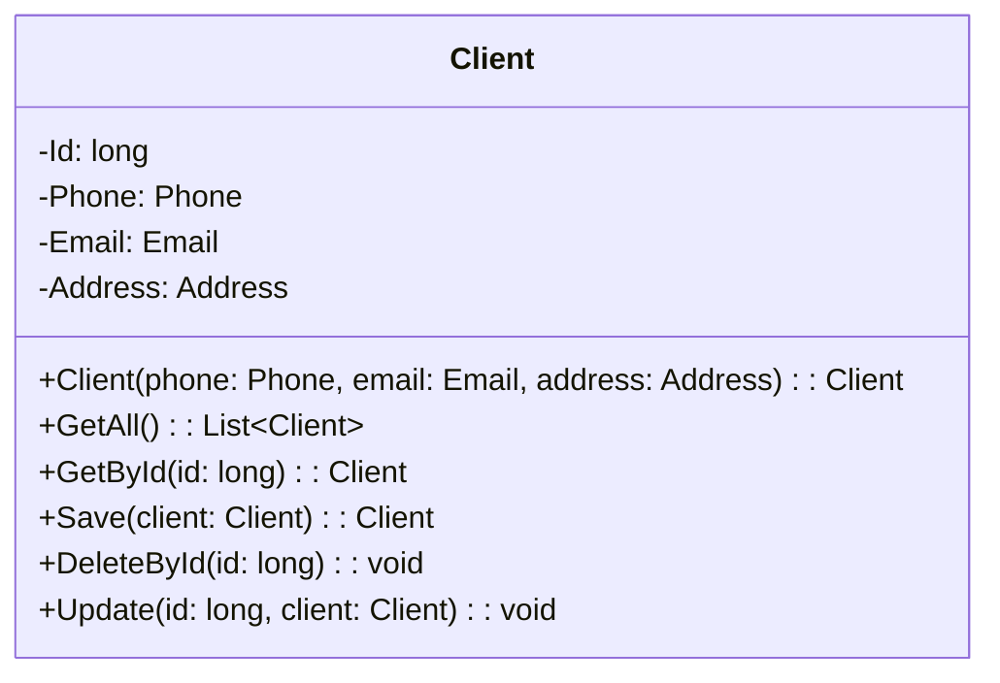
```mermaid
classDiagram
    class Client {
        -Id: long
        -Phone: Phone
        -Email: Email
        -Address: Address
        +Client (phone: Phone, email: Email, address: Address): Client
        +GetAll (): List&lt;Client&gt;
        +GetById (id: long): Client
        +Save (client: Client): Client
        +DeleteById (id: long): void
        +Update (id: long, client: Client): void
    }
```

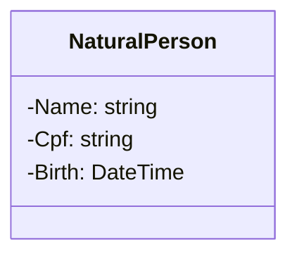
```mermaid
classDiagram
    class NaturalPerson {
        -Name: string
        -Cpf: string
        -Birth: DateTime
    }
```

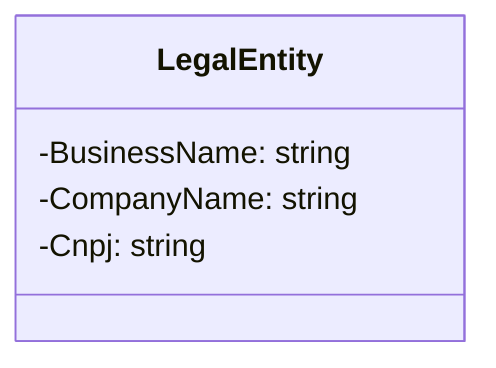
```mermaid
classDiagram
    class LegalEntity {
        -BusinessName: string
        -CompanyName: string
        -Cnpj: string
    }
```

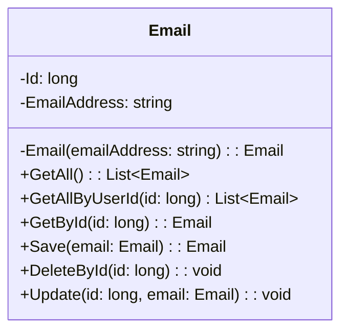
```mermaid
classDiagram
    class Email {
        -Id: long
        -EmailAddress: string
        -Email (emailAddress: string): Email
        +GetAll (): List&lt;Email&gt;
        +GetAllByUserId (id: long) List&lt;Email&gt;
        +GetById (id: long): Email
        +Save (email: Email): Email
        +DeleteById (id: long): void
        +Update (id: long, email: Email): void
    }
```

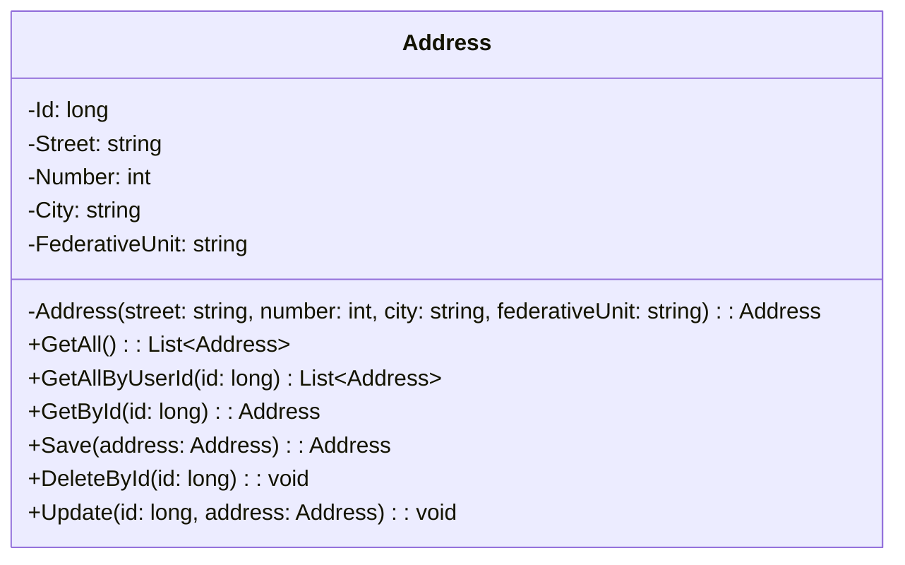
```mermaid
classDiagram
    class Address {
        -Id: long
        -Street: string
        -Number: int
        -City: string
        -FederativeUnit: string
        -Address (street: string, number: int, city: string, federativeUnit: string): Address
        +GetAll (): List&lt;Address&gt;
        +GetAllByUserId (id: long) List&lt;Address&gt;
        +GetById (id: long): Address
        +Save (address: Address): Address
        +DeleteById (id: long): void
        +Update (id: long, address: Address): void
    }
```

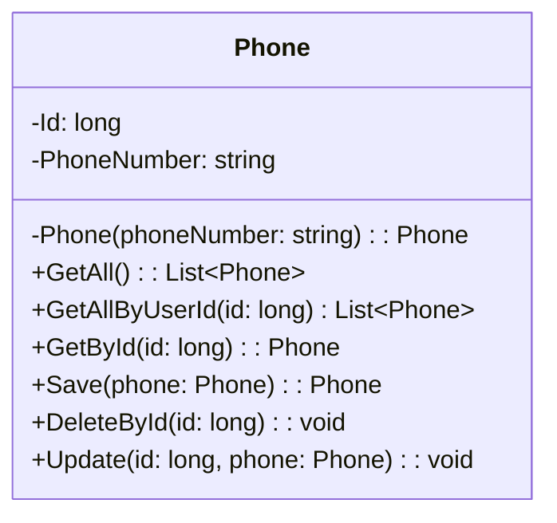
```mermaid
classDiagram
    class Phone {
        -Id: long
        -PhoneNumber: string
        -Phone (phoneNumber: string): Phone
        +GetAll (): List&lt;Phone&gt;
        +GetAllByUserId (id: long) List&lt;Phone&gt;
        +GetById (id: long): Phone
        +Save (phone: Phone): Phone
        +DeleteById (id: long): void
        +Update (id: long, phone: Phone): void
    }
```

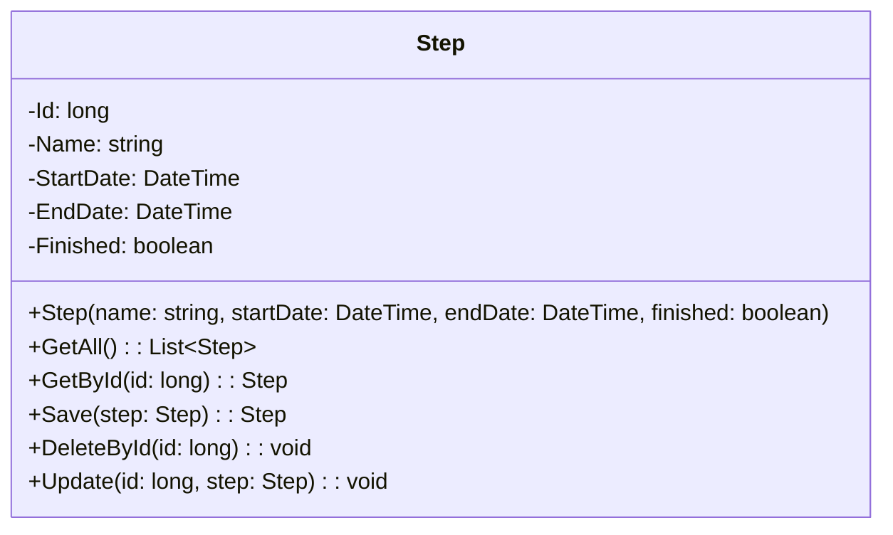
```mermaid
classDiagram
    class Step {
        -Id: long
        -Name: string
        -StartDate: DateTime
        -EndDate: DateTime
        -Finished: boolean
        +Step (name: string, startDate: DateTime, endDate: DateTime, finished: boolean)
        +GetAll (): List&lt;Step&gt;
        +GetById (id: long): Step
        +Save (step: Step): Step
        +DeleteById (id: long): void
        +Update (id: long, step: Step): void
    }
```

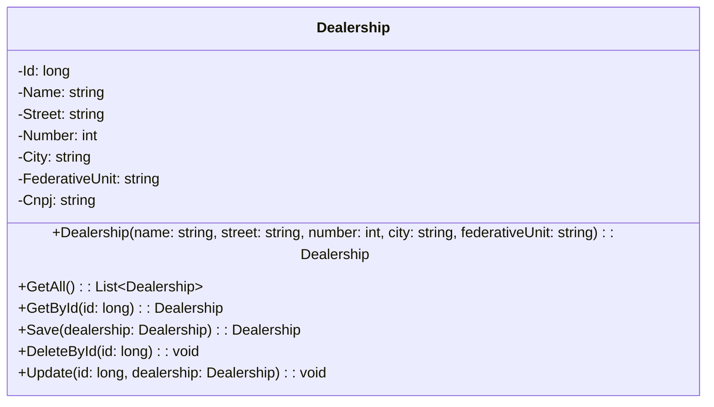
```mermaid
classDiagram
    class Dealership {
        -Id: long
        -Name: string
        -Street: string
        -Number: int
        -City: string
        -FederativeUnit: string
        -Cnpj: string
        +Dealership (name: string, street: string, number: int, city: string, federativeUnit: string): Dealership
        +GetAll (): List&lt;Dealership&gt;
        +GetById (id: long): Dealership
        +Save (dealership: Dealership): Dealership
        +DeleteById (id: long): void
        +Update (id: long, dealership: Dealership): void
    }
```

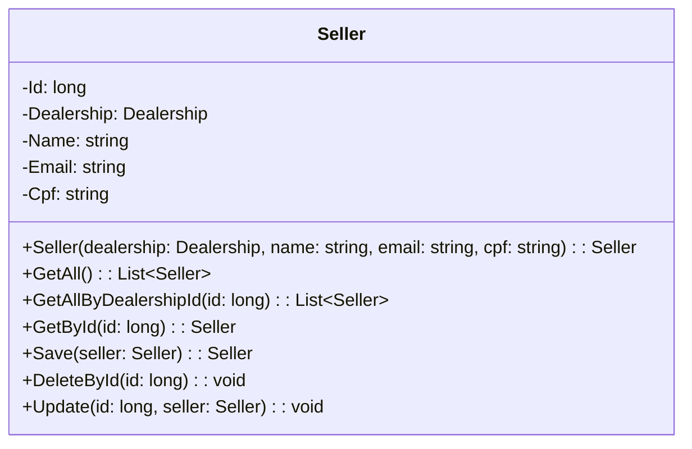
```mermaid
classDiagram
    class Seller {
        -Id: long
        -Dealership: Dealership
        -Name: string
        -Email: string
        -Cpf: string
        +Seller (dealership: Dealership, name: string, email: string, cpf: string): Seller
        +GetAll (): List&lt;Seller&gt;
        +GetAllByDealershipId (id: long): List&lt;Seller&gt; 
        +GetById (id: long): Seller
        +Save (seller: Seller): Seller
        +DeleteById (id: long): void
        +Update (id: long, seller: Seller): void
    }
```

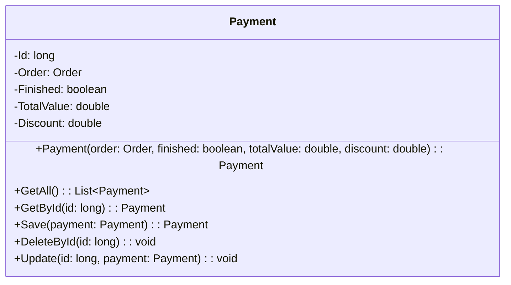
```mermaid
classDiagram
    class Payment {
        -Id: long
        -Order: Order
        -Finished: boolean
        -TotalValue: double
        -Discount: double
        +Payment (order: Order, finished: boolean, totalValue: double, discount: double): Payment
        +GetAll (): List&lt;Payment&gt;
        +GetById (id: long): Payment
        +Save (payment: Payment): Payment
        +DeleteById (id: long): void
        +Update (id: long, payment: Payment): void
    }
```

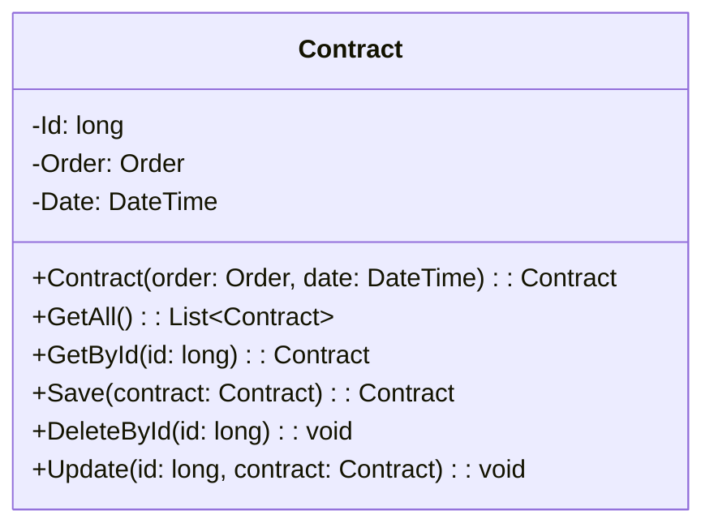
```mermaid
classDiagram
    class Contract {
        -Id: long
        -Order: Order
        -Date: DateTime
        +Contract(order: Order, date: DateTime): Contract
        +GetAll (): List&lt;Contract&gt;
        +GetById (id: long): Contract
        +Save (contract: Contract): Contract
        +DeleteById (id: long): void
        +Update (id: long, contract: Contract): void
    }
```

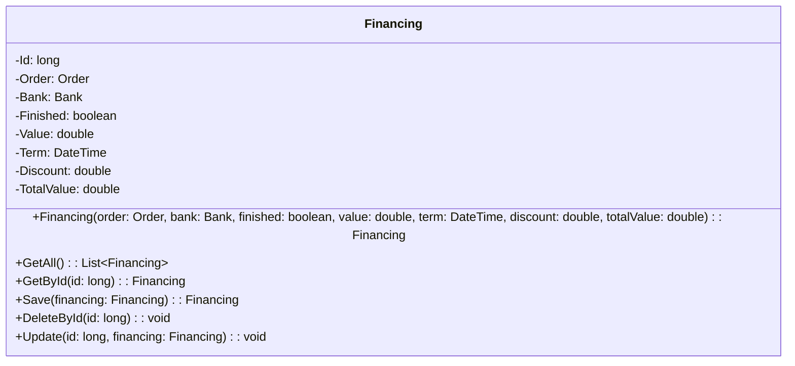
```mermaid
classDiagram
    class Financing {
        -Id: long
        -Order: Order
        -Bank: Bank
        -Finished: boolean
        -Value: double
        -Term: DateTime
        -Discount: double
        -TotalValue: double
        +Financing (order: Order, bank: Bank, finished: boolean, value: double, term: DateTime, discount: double, totalValue: double): Financing
        +GetAll (): List&lt;Financing&gt;
        +GetById (id: long): Financing
        +Save (financing: Financing): Financing
        +DeleteById (id: long): void
        +Update (id: long, financing: Financing): void
    }
```

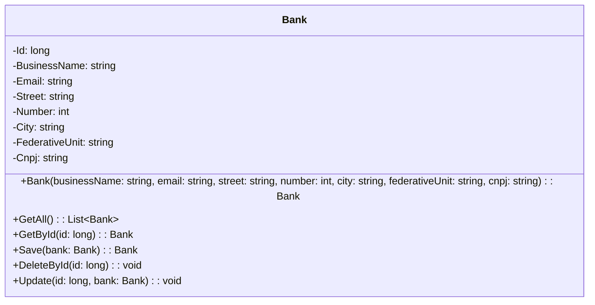
```mermaid
classDiagram
    class Bank {
        -Id: long
        -BusinessName: string
        -Email: string
        -Street: string
        -Number: int
        -City: string
        -FederativeUnit: string
        -Cnpj: string
        +Bank (businessName: string, email: string, street: string, number: int, city: string, federativeUnit: string, cnpj: string): Bank
        +GetAll (): List&lt;Bank&gt;
        +GetById (id: long): Bank
        +Save (bank: Bank): Bank
        +DeleteById (id: long): void
        +Update (id: long, bank: Bank): void
    }
```

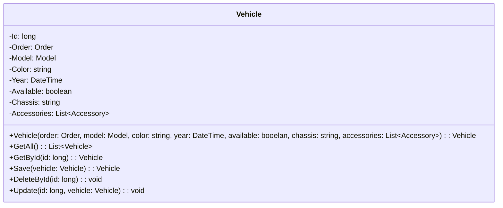
```mermaid
classDiagram
    class Vehicle {
        -Id: long
        -Order: Order
        -Model: Model
        -Color: string
        -Year: DateTime
        -Available: boolean
        -Chassis: string
        -Accessories: List&lt;Accessory&gt;
        +Vehicle (order: Order, model: Model, color: string, year: DateTime, available: booelan, chassis: string, accessories: List&lt;Accessory&gt;): Vehicle
        +GetAll (): List&lt;Vehicle&gt;
        +GetById (id: long): Vehicle
        +Save (vehicle: Vehicle): Vehicle
        +DeleteById (id: long): void
        +Update (id: long, vehicle: Vehicle): void
    }
```

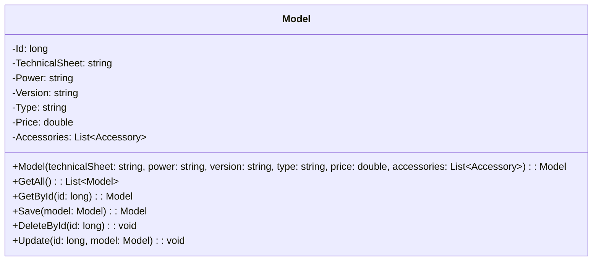
```mermaid
classDiagram
    class Model {
        -Id: long
        -TechnicalSheet: string
        -Power: string
        -Version: string
        -Type: string
        -Price: double
        -Accessories: List&lt;Accessory&gt;
        +Model (technicalSheet: string, power: string, version: string, type: string, price: double, accessories: List&lt;Accessory&gt;): Model
        +GetAll (): List&lt;Model&gt;
        +GetById (id: long): Model
        +Save (model: Model): Model
        +DeleteById (id: long): void
        +Update (id: long, model: Model): void

    }
```

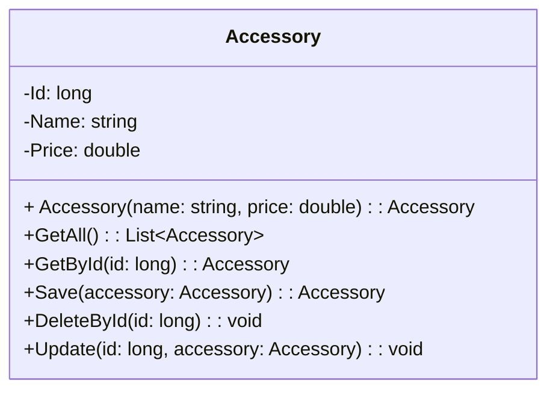
```mermaid
classDiagram
    class Accessory {
        -Id: long
        -Name: string
        -Price: double
        + Accessory (name: string, price: double): Accessory
        +GetAll (): List&lt;Accessory&gt;
        +GetById (id: long): Accessory
        +Save (accessory: Accessory): Accessory
        +DeleteById (id: long): void
        +Update (id: long, accessory: Accessory): void
    }
```

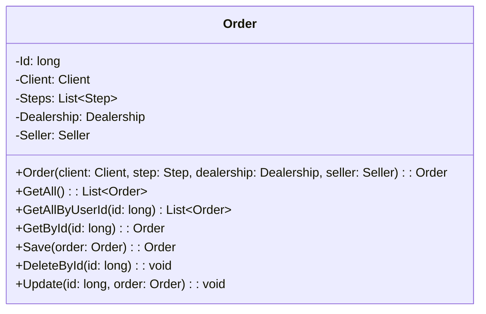
```mermaid
classDiagram
    class Order {
        -Id: long
        -Client: Client
        -Steps: List&lt;Step&gt;
        -Dealership: Dealership
        -Seller: Seller
        +Order (client: Client, step: Step, dealership: Dealership, seller: Seller): Order
        +GetAll (): List&lt;Order&gt;
        +GetAllByUserId (id: long) List&lt;Order&gt;
        +GetById (id: long): Order
        +Save (order: Order): Order
        +DeleteById (id: long): void
        +Update (id: long, order: Order): void
    }
```

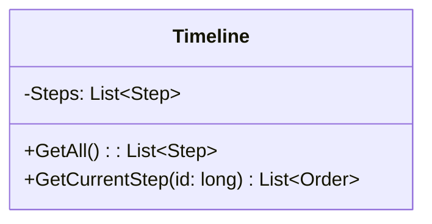
```mermaid
classDiagram
    class Timeline {
        -Steps: List&lt;Step&gt;
        +GetAll (): List&lt;Step&gt;
        +GetCurrentStep (id: long) List&lt;Order&gt;
    }
```
